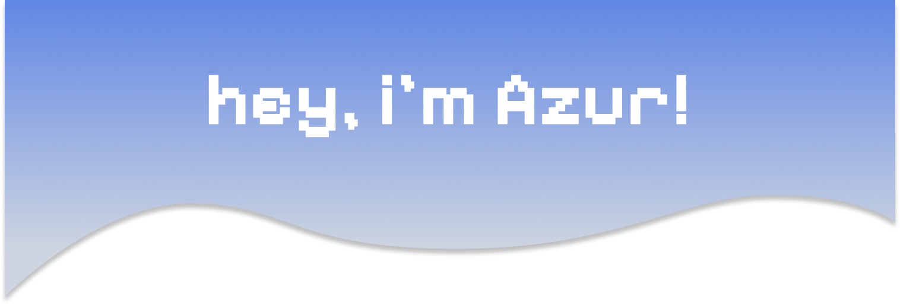
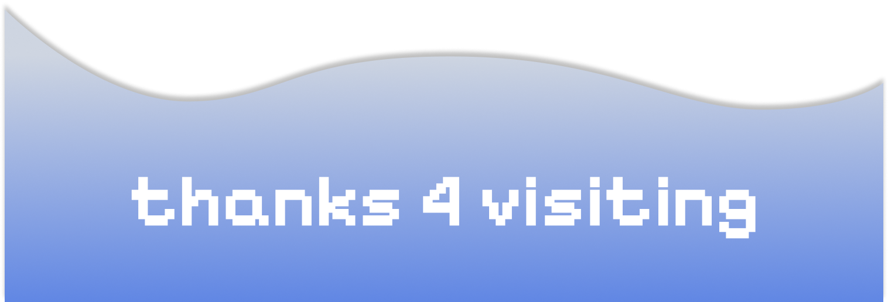

  

Hi, I’m **Azur**, a 21-year-old **Computer Science student** at Hochschule Bochum, Germany, and a **Full-Stack Developer**.  
I enjoy crafting interfaces that might look simple at first glance, but are technically **UI/UX near-perfect**, with consistent design and smooth, intuitive user flows.

## Tech Stack

### Frontend
- **Frameworks:**  Svelte •  React
- **Styling:**  TailwindCSS
- **Languages:**  JavaScript •  TypeScript

### Backend
- **Platforms:**  .NET •  C#
- **Databases:**  SQL (PostgreSQL / MySQL)

### Tools & Workflow
- **OS:**  Arch Linux
- **Version Control:**  Git
- **Package Managers:**  npm •  bun
- **Design:**  Photoshop •  Figma (UI/UX design & prototyping)

## 📊 GitHub Stats

  
  

## 💡 What I Love
I’m passionate about **creating frontends** with Svelte, React, and TailwindCSS that feel effortless to use,  
while using **media design skills** in Photoshop & Figma to plan consistent and visually appealing UIs.  
On the backend, I enjoy **engineering scalable solutions** with .NET and C#, ensuring everything works smoothly under the hood.

  

